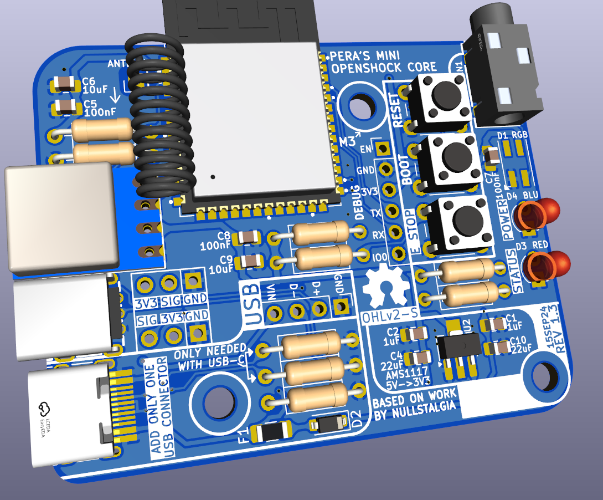
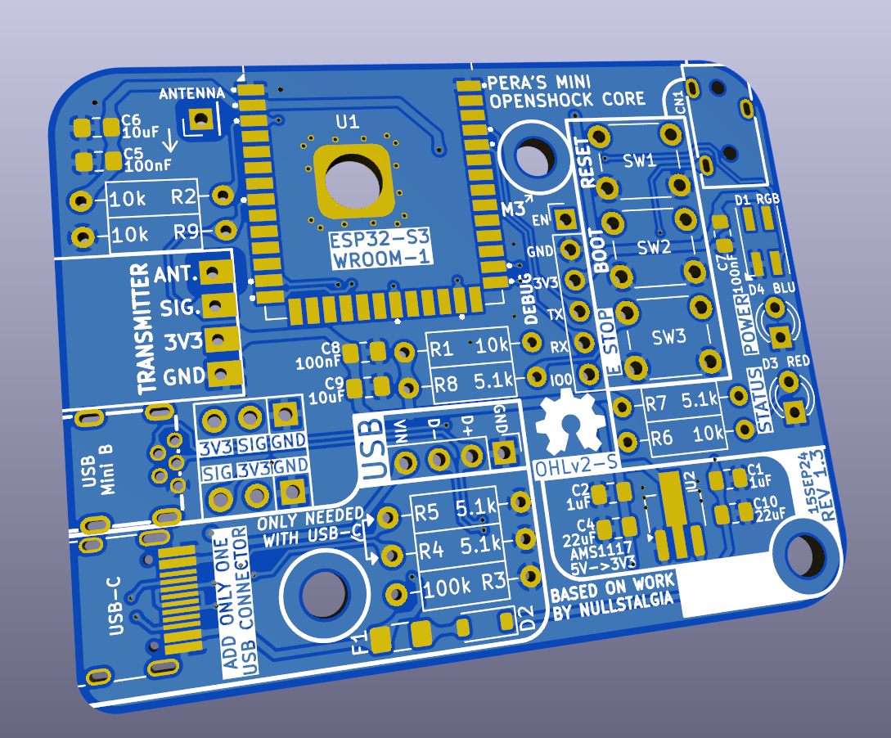
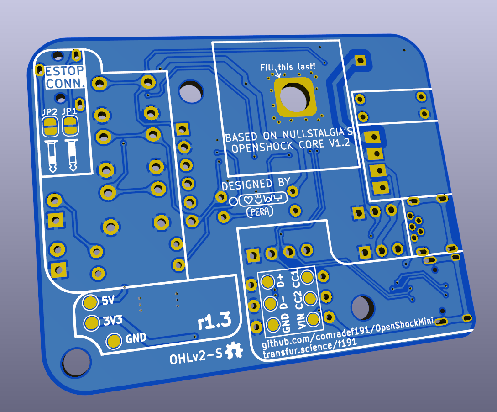

## OpenShock Mini r1.3
Based on OpenShock Core V1.2

Customised OpenShock Core v1.2 derivative, with clearer component labelling & through-hole components intended to assist in manual low-volume assembly

#### CHANGES FROM REGULAR OPENSHOCK:
- Capacitors switched over to 0805 and clearly labelled for easy assembly
- Resistors have been converted to use standard through-hole resistors, with clearly marked resistance values
- Custom ESP32 footprint clearly marks essential pins, and makes soldering of the underside ground pads far easier
- Optional USB Mini-B footprint which may be populated if USB-C is beyond your ability to solder
- Standardised all buttons to use generic 6mm SPST buttons
- Now uses a pair of round 3mm THT LEDs rather than SMD ones; RGB LED remains unchanged
- 5V->3V3 Regulator switched to a slighty smaller and cheaper MSKSEMI AMS1117 rather than AMS (C5120796)
- Board footprint heavily reduced compared to V1.2, only slightly exceeding V2.2L

Important Notes:
- LCSC does not stock a 433MHz antenna that would be suitable for this board, thus you need to [order one from Aliexpress](https://aliexpress.com/item/1005005557947265.html); I reccomend one 28mm long, which rises up 6mm before bending.
- Install only one of the USB ports. If installing the USB-C port, R5 & R4 must be installed also.

#### Specs:
- ESP32-S3-WROOM-1
- USB-C or Mini-B
- Pinouts for several transmitters for DIY users
- In-built E-Stop button and AUX E-Stop port (3.5mm TRS jack)
- No USB-UART, uses built-in USB on ESP32-S3
- Low-Noise Texas Instruments 3.3v regulator
- Footprint 46 x 58mm

#### Bill of Materials:
|Component                     |QTY|LCSC P/N |Comment
|------------------------------|---|---------|-------|
|0805 Capacitor, 100nF         | 3 |C476766  |       |
|0805 Capacitor, 1uF           | 2 |C215803  |       |
|0805 Capacitor, 10uF          | 2 |C1713    |       |
|0805 Capacitor, 22uF          | 2 |C98190   |       |
|Through-Hole Resistor, 5.1k   | 4 |C58591   |       |
|Through-Hole Resistor, 10k    | 4 |C57436   |       |
|Through-Hole Resistor, 100k   | 1 |C58597   |       |
|LED, SMD; RGB (D1)            | 1 |C527089  |       |
|LED, Through-Hole; Red (D3)   | 1 |C440523  |       |
|LED, Through-Hole; Blue (D4)  | 1 |C2895474 |       |
|B5819W-SL Diode (D2)          | 1 |C8598    |       |
|Fuse, 1206 SMD, 250mW 800v    | 1 |C17888   |       |
|3.5mm Port (EStop Connector)  | 1 |C2689690 |       |
|SPST Buttons                  | 3 |C2837516 |       |
|AMS1117 Voltage Regulator     | 1 |C5120796 |       |
|ESP32-S3-WROOM-1 N16R8        | 1 |C2913202 |Reccomend [Aliexpress](https://www.aliexpress.com/item/1005006661866218.html)|
|DL-TX1-433M 433MHz Transmitter| 1 |C381160  |       |
|433MHz Antenna                | 1 | None :C |See Important Notes section|
|USB-C Connector               | 1 |C165948  |USE ONE OR THE OTHER.|
|USB Mini-B Connector          | 1 |C720612  |USE ONE OR THE OTHER.|

### Gallery

