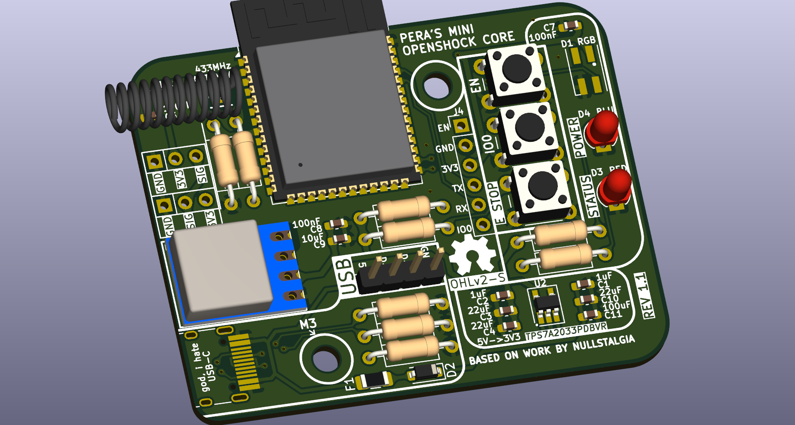
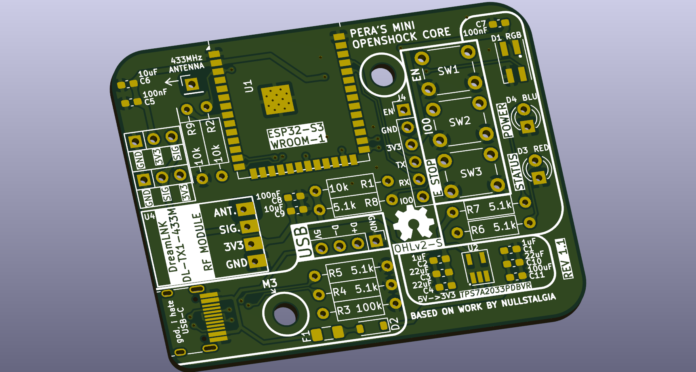
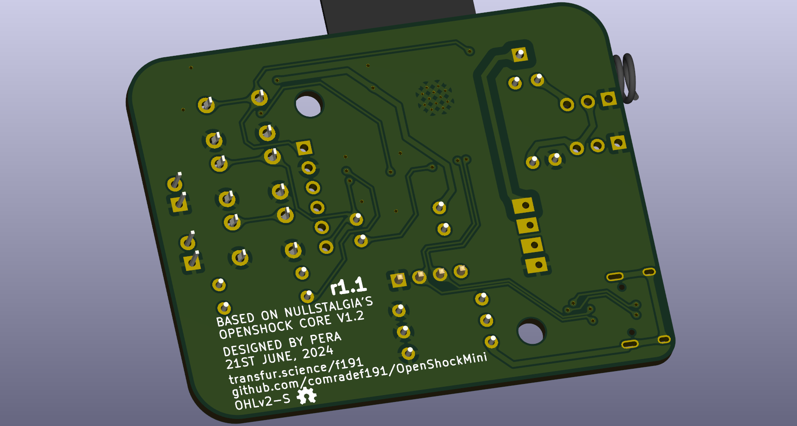

## OpenShock Mini r1.1
Based on OpenShock Core V1.1

Customised OpenShock Core v1.1 derivative, with clearer component labelling & through-hole components intended to assist in manual low-volume assembly

#### CHANGES FROM REGULAR OPENSHOCK:
- All capacitors remain 0603 footprint, though with plentiful spacing and clear labelling of capacitance values
- Resistors have been converted to use standard through-hole resistors, with clearly marked resistance values
- Standardised all buttons to use generic 6mm SPST buttons
- Now uses a pair of round 3mm THT LEDs rather than SMD ones; RGB LED remains unchanged.
- 433MHz Antenna replaced with one sold by LCSC, and not just JLCPCB
- 5V->3V3 Regulator upgraded to Low-Noise TPS7A2033PDBVR, from older AMS1117-3.3 
  - Standard TI SOT-23-5 footprint, if low-noise chip is out-of-stock or higher amperage needed
- Board footprint heavily reduced

#### Specs:
- ESP32-S3-WROOM-1
- USB-C
- Pinouts for several transmitters for DIY users
- In-built E-Stop button
- No USB-UART, uses built-in USB on ESP32-S3
- Low-Noise Texas Instruments 3.3v regulator
- Footprint 46 x 58mm

### Gallery

